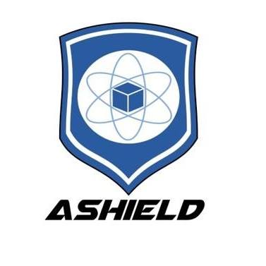

<p align="center">
  <a href="https://www.facebook.com/Projet-Ashield-1590097147748580/">
    
  </a>
</p>

# AShield Project

Computer vision and some BeagleBone Black kernel.

## Getting Started


### Prerequisites

Required libraries :
* **OpenCV 3.4.0**+
* **Numpy 1.14.2**+
* **pyserial 3.4**+

Command for installing all dependencies :

#### Linux

```
sudo apt-get install python-opencv
sudo apt-get install python-pip
pip install numpy
pip install pyserial
```

Keep in mind that ```python-opencv``` is a wrapper it is better to compile it.

### Installing

Clone the repository
```
git clone https://github.com/raymas/AShield.git
```

## Contributing

Please read [CONTRIBUTING.md]() for details on our code of conduct, and the process for submitting pull requests to us.

## Authors

* **raymas** - *Initial work* - [raymas](https://github.com/raymas)

See also the list of [contributors](https://github.com/raymas/AShield/contributors) who participated in this project.

## License

This project is licensed under the GNU 3.0 License - see the [LICENSE.md](LICENSE.md) file for details
